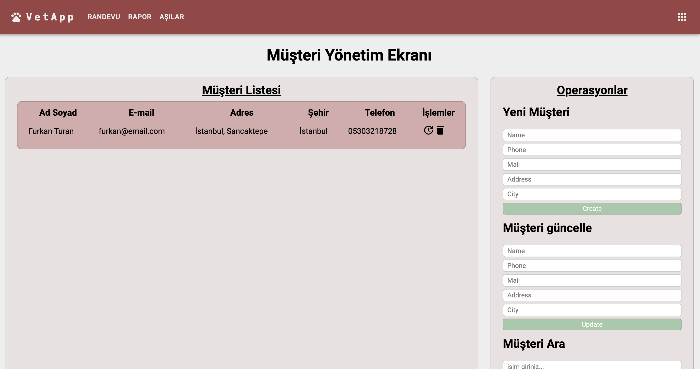

You can access the live version of the project from the link provided here -> https://veterinary-app-ochre.vercel.app/

A veterinary management system project has been developed with an API that allows a veterinary clinic to manage its own operations.

The application is intended to be used by veterinary staff. With this application, staff members can register veterinary doctors, record their working days (available days), and make date entries without specifying the time.

Furthermore, the application enables staff to record customers, register animals owned by customers, document administered vaccinations for animals along with their dates, and schedule appointments for animals with veterinary doctors.

When creating appointments, staff members must enter both the date and time. The system will perform checks without specifying the time based on the doctor's available days during the scheduling process. Additionally, it will verify the date and time against existing appointment records. If there are no conflicts in the records, the appointment will be successfully created.

- This project has been initiated using Spring Initializr to develop a REST API, and the necessary dependencies have been defined.

- The project follows a layered architecture, comprising the Entity, Repository, Service, and Controller layers.

- Inversion of Control (IoC) and Dependency Injection (DI) have been implemented using constructor injection.

- Requisite annotations such as @Entity, @Table, @Id, @OneToMany, @ManyToOne, and @ManyToMany have been added.

- PostgreSQL is utilized as the database system for the project.

- The application's design features a modern and visually appealing interface created with popular libraries like Material-UI. Users can easily navigate and quickly perform the desired tasks. The application works seamlessly on different screen sizes (responsive) and provides users with a rich experience.

- The frontend of the project was developed with React.

The project encompasses the following endpoints:

| HTTP Method | Endpoint                 | Description                              |
|-------------|--------------------------|------------------------------------------|
| GET         | /v1/customers            | Lists all customers                      |  
| GET         | /v1/customers/{id}       | Lists a customer with a specific ID      |
| GET         | /v1/customer/name={name} | Lists a customer based on the name       |
| POST        | /v1/customers            | Adds a new customer                      |
| PUT         | /v1/customers/{id}       | Updates information for a customer by ID |
| DELETE      | /v1/customers/{id}       | Deletes a specific customer by ID        |

| HTTP Method | Endpoint                                | Description                            |
|-------------|-----------------------------------------|----------------------------------------|
| GET         | /v1/animals                             | Lists all animals                      |  
| GET         | /v1/animals/{id}                        | Lists an animal with a specific ID     |
| GET         | /v1/animals/name={name}                 | Lists an animal based on the name      |
| GET         | /v1/animals/customerName={customerName} | Lists an animal based on its owner     |
| POST        | /v1/animals                             | Adds a new animal                      |
| PUT         | /v1/animals/{id}                        | Updates information for an animal by ID |
| DELETE      | /v1/animals/{id}                        | Deletes a specific animal by ID        |

| HTTP Metodu | Endpoint                         | Description                                                                            |
|-------------|----------------------------------|----------------------------------------------------------------------------------------|
| GET         | /v1/vaccines                     | Lists all vaccines                                                                     |  
| GET         | /v1/vaccines/{id}                | Lists a vaccine with a specific ID                                                     |
| GET         | /v1/vaccines/upcomings           | Lists the vaccinations with approaching expiration dates within the entered date range |
| GET         | /v1/vaccines/animalId={animalId} | Lists the vaccines based on the animal ID                                              |
| POST        | /v1/vaccines                     | Adds a new vaccine                                                                     |
| PUT         | /v1/vaccines/{id}                | Updates information for a vaccine by ID                                                |
| DELETE      | /v1/vaccines/{id}                | Deletes a specific vaccine by ID                                                       |

| HTTP Method | Endpoint         | Description                            |
|-------------|------------------|----------------------------------------|
| GET         | /v1/doctors      | Lists all doctors                      |  
| GET         | /v1/doctors/{id} | Lists a doctor with a specific ID      |
| POST        | /v1/doctors      | Adds a new doctor                      |
| PUT         | /v1/doctors/{id} | Updates information for a doctor by ID |
| DELETE      | /v1/doctors/{id} | Deletes a specific doctor by ID        |

| HTTP Method | Endpoint                | Description                               |
|-------------|-------------------------|-------------------------------------------|
| GET         | /v1/availableDates      | Lists all available dates of doctors      |  
| GET         | /v1/availableDates/{id} | Lists an available date with a specific ID |
| POST        | /v1/availableDates      | Adds a new available date                 |
| PUT         | /v1/availableDates/{id} | Updates an available date by ID           |
| DELETE      | /v1/availableDates/{id} | Deletes a specific available date by ID   |

| HTTP Method | Endpoint                  | Description                                                     |
|-------------|---------------------------|-----------------------------------------------------------------|
| GET         | /v1/appointments          | Lists all appointments                                          |  
| GET         | /v1/appointments/{id}     | Lists an appointment with a specific ID                         |
| GET         | /v1/appointments/doctorId | Lists appointments based on the entered date range and doctor ID |
| GET         | /v1/appointments/animalId | Lists appointments based on the entered date range and animal ID |
| POST        | /v1/appointments          | Adds a new appointment                                          |
| PUT         | /v1/appointments/{id}     | Updates information for an appointment by ID                    |
| DELETE      | /v1/appointments/{id}     | Deletes a specific appointment by ID                            |

| HTTP Method | Endpoint              | Description                         |
|-------------|-----------------------|-------------------------------------|
| GET         | /v1/reports           | Lists all reports                   |  
| GET         | /v1/reports/{id}      | Lists an reports with a specific ID |
| POST        | /v1/reports           | Creates report                      |
| PUT         | /v1/reports/{id}      | Updates report with a specific ID   |
| DELETE      | /v1/reports/{id} | Deletes report with a specific ID   |